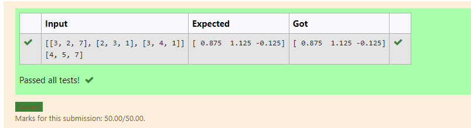

# LU Decomposition without zero on the diagonal

## AIM:
To write a program to find the LU Decomposition of a matrix.

## Equipments Required:
1. Hardware – PCs
2. Anaconda – Python 3.7 Installation / Moodle-Code Runner

## Algorithm
1. using linalg import lu
2. assign a variable to store the input
3. assign p, l, u to lu(a) 
4. print l and u

## Program:
```
/*
Program to find the LU Decomposition of a matrix.
Developed by:Jeswanth.s 
RegisterNumber:21001768

import numpy
from scipy.linalg import lu
a=numpy.array(eval(input()))
p,l,u = lu(a)
print(l)
print(u)

*/
```

## Output:


## Result:
Thus the program to find the LU Decomposition of a matrix is written and verified using python programming.


# LU Decomposition without zero on the diagonal

## AIM:
To write a program to find the LU Decomposition of a matrix.

## Equipments Required:
1. Hardware – PCs
2. Anaconda – Python 3.7 Installation / Moodle-Code Runner

## Algorithm
1. using linalg import lu
2. assign a,b variable to store the input
3. assign x to lu factor(a) 
4. print x

## Program:
```
/*
Program to find the LU Decomposition of a matrix.
Developed by:Jeswanth.s 
RegisterNumber:21001768

import numpy as np
from scipy.linalg import lu_factor, lu_solve
a= np.array(eval(input()))
b= np.array(eval(input()))
lu, pivot = lu_factor(a)
x = lu_solve((lu,pivot),b)
print(x)


*/
```

## Output:



## Result:
Thus the program to find the LU Decomposition of a matrix is written and verified using python programming.


